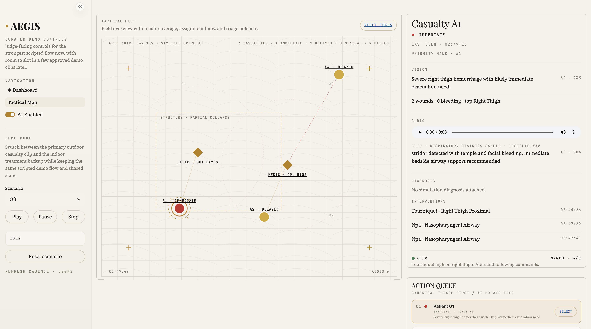

# AEGIS

**AI-Enhanced Guidance for Integrated Survival**

AEGIS is an offline, edge-deployable AI copilot for combat medics operating in
Mass Casualty (MASCAL) events. It helps one medic manage many casualties by
turning scene perception into a human-confirmed workflow: wound detection,
respiratory cues, casualty prioritization, triage support, and evacuation
handoff.

> *A shield of perception for those who shield others.*



## The Problem

Up to 24% of battlefield deaths are potentially survivable with faster
prehospital care. The bottleneck is not medical knowledge. Medics already know
what to do. The bottleneck is **perception at scale**: seeing every wound,
hearing every airway, tracking every casualty, and prioritizing attention fast
enough under stress, smoke, darkness, and noise.

AEGIS is built to reduce that overload without taking decision authority away
from the medic.

## What AEGIS Does

- **Vision**: detects casualties, localizes visible wounds, estimates bleeding
  severity, and supports scene-level prioritization
- **Audio**: stages respiratory cues and casualty-linked breath samples for
  review
- **Voice**: supports a hands-free command workflow for triage and
  intervention logging
- **Triage support**: uses SALT/TCCC-aligned logic to rank casualties and
  surface the next medic action
- **Clinical reasoning**: supports triage suggestions with local
  medic-readable rationale
- **Shared state**: keeps dashboard, tactical map, queue, and medic POV views
  synchronized through one local application state
- **Offline operation**: runs locally with no cloud dependency

## Demo Surfaces

The current hackathon build centers on two curated demo-ready clips:

- **Outdoor Face Wound Demo**
  - primary hero clip
  - expected output: one primary casualty, one primary face/neck bleeding wound
- **Indoor Treatment Demo**
  - bedside treatment backup clip
  - used both as a standalone scenario and as a medic POV feed in Tactical Map

Available demo surfaces:

- **Dashboard**: live video pane, casualty roster, medic confirmation queue,
  audio/voice panel
- **Tactical Map**: stylized overhead plot, action queue, casualty drill-down,
  medic POV panels, zone roster
- **Landing page**: editorial Next.js site that mirrors the dashboard’s visual
  language

Canonical demo assets live in:

- `assets/demo_videos/`
- `assets/judge_reels/`
- `docs/demo_video_manifest.md`

## Safety and Human Control

AEGIS is **perception augmentation**, not autonomous triage.

Core safeguards in the current build:

- every AI suggestion requires medic confirmation before it changes state
- AI suggestions can be dismissed without side effects
- expectant / deceased categorization is medic-only
- audit history is stored locally in the shared state
- the medic can disable AI assistance entirely from the UI

## Current Architecture

```text
RGB Video ─┐
           ├─> Vision pipeline ─┐
Audio   ───┘                    │
                                ├─> Shared App State ─> Dashboard / Tactical Map
Voice Commands ────────────────┘
                                └─> Triage engine / MEDEVAC draft / Audit trail
```

Main runtime components in this repo:

- `vision/` — wound analysis, tracking, demo profiles, video processing
- `audio/` — breathing classification assets and scripts
- `shared/state.py` — thread-safe application state singleton
- `triage_engine.py` — SALT/TCCC-oriented triage logic and MEDEVAC draft support
- `scenario_ranker.py` — ranking helper used by the Tactical Map priority queue
- `ui/` — Streamlit dashboard and Tactical Map
- `landing/` — Next.js landing page
- `simulation/` — teammate simulation casualties and supporting demo data

## Built With

| Category | Technologies |
|---|---|
| Languages | Python, TypeScript, JavaScript, HTML/CSS |
| Vision / CV | OpenCV, Ultralytics YOLOv8, Segment Anything (SAM / MobileSAM), ByteTrack |
| Audio / signal processing | Librosa, NumPy, pandas, scikit-learn, curated respiratory audio samples |
| Triage / reasoning | Local SALT / TCCC triage engine, Meta Llama 3.2 via Ollama |
| Dashboard UI | Streamlit |
| Landing page | Next.js 14, React, TypeScript, Tailwind CSS, Framer Motion |
| API / backend | FastAPI, Pydantic, Uvicorn |
| Deployment target | Fully offline local runtime, designed for Jetson Orin NX or laptop fallback |

AEGIS is built to run **fully offline** for demo and edge use. It does **not**
depend on cloud services or an external database for the core workflow.

## Quick Start

### Dashboard / Tactical Map

```bash
git clone https://github.com/AarinB1/Aegis.git
cd Aegis

python3 -m venv .venv
source .venv/bin/activate
pip install -r requirements.txt

streamlit run ui/app.py
```

Once the app is open:

- use the sidebar to switch between `Off`, `Outdoor Face Wound Demo`, and
  `Indoor Treatment Demo`
- use `Dashboard` for the main demo flow
- use `Tactical Map` for the ranked queue, medic POVs, and casualty drill-down

### Landing Page

```bash
cd landing
npm install
npm run dev
```

The landing page serves locally on the port you choose for `next dev`. In the
current committed build, the Launch Dashboard CTA targets
`http://localhost:8501` by default for local development.

## Demo Commands

Run the curated UI demo:

```bash
streamlit run ui/app.py
```

Run the wound pipeline directly on test assets:

```bash
python -m vision.cli assets/test_wound.jpg --pixels-per-cm 12
python scripts/run_wound_detection.py assets/test_wound.jpg --pixels-per-cm 12
python scripts/run_wound_detection_video.py assets/test_wound_video.avi --pixels-per-cm 12 --frame-stride 3
```

Run the curated multi-casualty judge scenarios:

```bash
python scripts/run_judge_demo.py hero --allow-builtin-yolo --skip-reel
python scripts/run_judge_demo.py indoor --allow-builtin-yolo --skip-reel
python scripts/run_judge_demo.py torso --allow-builtin-yolo --skip-reel
python scenario_ranker.py outputs/judge_demo/*/*_video_wounds.json
```

Generate synthetic demo assets:

```bash
python scripts/generate_demo_assets.py
```

## How the Triage Engine Works

The triage engine is a two-layer system:

- **Layer 1 — Rule-based SALT/TCCC scoring**
  - deterministic, doctrine-aligned, auditable
  - bleeding, wound location, responsiveness, and respiratory state drive the
    canonical priority
- **Layer 2 — Local clinical reasoning**
  - generates medic-readable rationale behind a suggested priority
  - does not override the rule engine’s final category

The engine never auto-assigns the expectant / deceased category. That remains
medic-only.

## Tactical Map

The Tactical Map is a three-column instrument:

- **Left**: stylized overhead plot with medic positions, casualty markers,
  assignment lines, and triage hotspots
- **Middle**: casualty drill-down or medic POV / zone roster depending on
  selection
- **Right**: live action queue ranked by canonical triage first, then AI
  confidence

It also includes:

- repo-backed casualty audio clips when available
- clip-specific medic POV feeds
- intervention history
- diagnosis / rationale surfaces when present in shared state

## Repo Structure

```text
Aegis/
├── assets/                 # Demo videos, reels, and test media
├── audio/                  # Audio assets and breathing classification scripts
├── docs/                   # Demo manifest, screenshots, handoff docs
├── landing/                # Next.js landing page
├── schema.py               # Shared casualty / wound / suggestion contract
├── scenario_ranker.py      # Priority queue ranking helper
├── scripts/                # Demo utilities and runnable scripts
├── shared/                 # AppState integration spine
├── simulation/             # Simulation casualties and related demo data
├── tests/                  # Python test suite
├── triage_engine.py        # Triage engine and MEDEVAC support
├── ui/                     # Streamlit dashboard and Tactical Map
└── vision/                 # Vision pipeline
```

## Hackathon Context

Built during the **Critical Ops: DC National Security Hackathon** for **Meta
Challenge #15** by a team of four in a 24-hour sprint.

This is a hackathon proof-of-concept, not a clinically validated medical
device. Production deployment would require significantly deeper validation,
human factors review, ruggedization, and domain partnership.

## Team

| Role | Owner |
|---|---|
| Vision pipeline | Aaryan Suri |
| Audio pipeline | Neal Rangarajan |
| Triage engine | Ansh Bhatia |
| UI / integration / demo delivery | Aarin Basu |

## Acknowledgments

AEGIS builds on and integrates with many open-source projects, including:

- Ultralytics / YOLOv8
- ByteTrack
- Grounding DINO
- Segment Anything family models
- DINOv2
- CLAP
- Whisper

It also draws on SALT and TCCC doctrine as the operational framing for triage
support.

## License

MIT License — see `LICENSE`.

Note: some underlying model dependencies may carry their own licenses and usage
constraints. Review them before any non-hackathon deployment.

## Contact

For questions about the project, open an issue in this repository.
